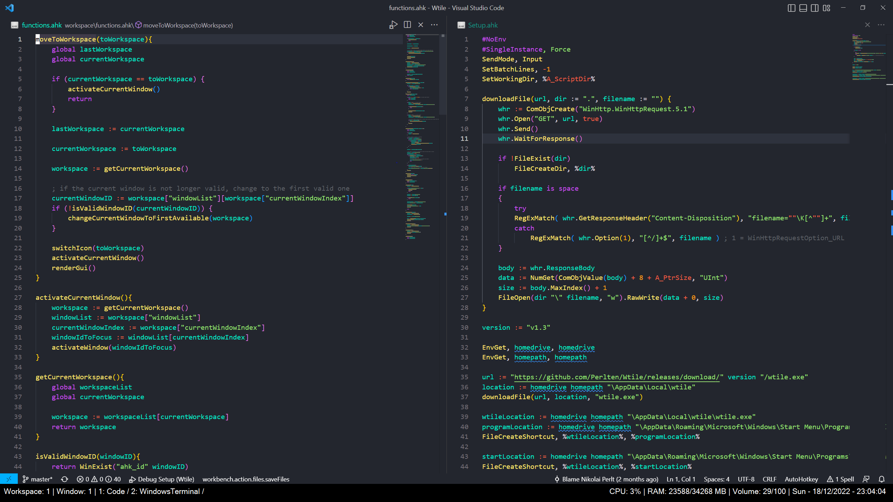

# Wtile

Wtile helps organize your windows into workspaces, making it consistent, easy and quick to move between applications. There is also a gui element that show information about the current workspaces on the left and the time, volume and cpu/ram usage on the right

## Examples

In this image the gui element has been placed on top of the regular taskbar. This can however be placed anywhere

## Features 
- [x] Remove window from workspace
- [ ] Control scroll speeds (windows-utils)
- [x] Alt tab for windows switch (rebind req alt tab to alt + q or something)
- [x] Deploy to winget
- [ ] Make winget part of pipeline
- [ ] Pull out always on top from guitick and run at more
- [ ] Change ram to show usage instead of remaining 

## Bugs
- [ ] For some reason Terminal created to windows inside a workspace